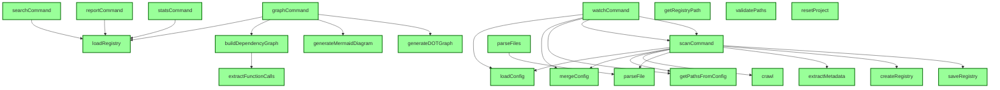

```mermaid
graph TD
  scanCommand["scanCommand"]:::exported
  watchCommand["watchCommand"]:::exported
  graphCommand["graphCommand"]:::exported
  searchCommand["searchCommand"]:::exported
  reportCommand["reportCommand"]:::exported
  loadRegistry["loadRegistry"]:::exported
  saveRegistry["saveRegistry"]:::exported
  loadConfig["loadConfig"]:::exported
  extractMetadata["extractMetadata"]:::exported
  parseFile["parseFile"]:::exported
  crawl["crawl"]:::exported
  buildDependencyGraph["buildDependencyGraph"]:::exported
  statsCommand["statsCommand"]:::exported
  createRegistry["createRegistry"]:::exported
  mergeConfig["mergeConfig"]:::exported
  getPathsFromConfig["getPathsFromConfig"]:::exported
  extractFunctionCalls["extractFunctionCalls"]:::exported
  generateMermaidDiagram["generateMermaidDiagram"]:::exported
  generateDOTGraph["generateDOTGraph"]:::exported
  parseFiles["parseFiles"]:::exported
  getRegistryPath["getRegistryPath"]:::exported
  validatePaths["validatePaths"]:::exported
  resetProject["resetProject"]:::exported
  scanCommand --> loadConfig
  scanCommand --> mergeConfig
  scanCommand --> getPathsFromConfig
  scanCommand --> crawl
  scanCommand --> parseFile
  scanCommand --> extractMetadata
  scanCommand --> createRegistry
  scanCommand --> saveRegistry
  watchCommand --> loadConfig
  watchCommand --> mergeConfig
  watchCommand --> getPathsFromConfig
  watchCommand --> scanCommand
  watchCommand --> scanCommand
  graphCommand --> loadRegistry
  graphCommand --> buildDependencyGraph
  graphCommand --> generateMermaidDiagram
  graphCommand --> generateDOTGraph
  searchCommand --> loadRegistry
  reportCommand --> loadRegistry
  buildDependencyGraph --> extractFunctionCalls
  statsCommand --> loadRegistry
  parseFiles --> parseFile

  classDef exported fill:#9f9,stroke:#060,stroke-width:2px
  classDef orphan fill:#f99,stroke:#900,stroke-width:2px
```